# 🤖 AI-Powered Conversational Event Creation - Implementation Plan

## 🎯 Vision Statement

Transform LifeLearners.org.nz event creation from tedious form-filling to natural conversation. Users simply chat with an AI assistant to create events, configure ticketing, set up notifications, and manage everything through natural language.

## 🏗️ Architecture Overview

### Current Foundation (Building On)
- ✅ **FastAPI Backend** - Perfect for AI endpoint integration
- ✅ **Event Models** - Existing Event/User/Child/Booking models 
- ✅ **Stripe Payments** - Already handles payment processing
- ✅ **PostgreSQL** - Structured data storage with JSONB for flexible AI data
- ✅ **Admin Dashboard** - UI components for event management

### New AI Components

```mermaid
graph TB
    User["👤 User Input<br/>Natural Language"] --> Chat["💬 Chat Interface<br/>React/WebSocket"]
    Chat --> AI["🧠 AI Service<br/>LLM + NLP"]
    AI --> Parser["📝 Event Parser<br/>Structured Conversion"]
    Parser --> Validator["✅ Validation Engine<br/>Business Rules"]
    Validator --> Database["🗄️ PostgreSQL<br/>Event Storage"]
    Database --> Confirmation["📧 Confirmation<br/>Preview & Approve"]
    
    AI --> Context["🧠 Context Manager<br/>Conversation State"]
    AI --> Suggestions["💡 Smart Suggestions<br/>Based on History"]
    AI --> Templates["📋 Event Templates<br/>Common Patterns"]
```


## 🚀 Phase 1: Foundation (Month 1-2)

### 1.1 AI Service Integration

**Technology Stack:**
- **LLM Provider**: OpenAI GPT-4 or Anthropic Claude (fallback support)
- **Conversation Management**: Custom state machine with Redis
- **NLP Processing**: Spacy for entity extraction + custom patterns
- **WebSocket**: Real-time chat interface

**New Models:**
```python
# app/models.py additions
class ConversationSession(Base):
    __tablename__ = "conversation_sessions"
    id = Column(String(36), primary_key=True, default=lambda: str(uuid.uuid4()))
    user_id = Column(Integer, ForeignKey("users.id"), nullable=False)
    event_id = Column(Integer, ForeignKey("events.id"), nullable=True)  # When event is created
    status = Column(String(20), default='active')  # active, completed, abandoned
    created_at = Column(DateTime, default=func.now())
    updated_at = Column(DateTime, default=func.now(), onupdate=func.now())
    
    # Conversation data
    messages = Column(JSON)  # Full conversation history
    extracted_data = Column(JSON)  # Parsed event data
    context = Column(JSON)  # AI context and preferences
    
    user = relationship("User")
    event = relationship("Event")

class EventTemplate(Base):
    __tablename__ = "event_templates"
    id = Column(Integer, primary_key=True)
    name = Column(String(100), nullable=False)
    category = Column(String(50), nullable=False)  # workshop, field-trip, etc.
    description = Column(Text)
    template_data = Column(JSON)  # Default field values
    conversation_prompts = Column(JSON)  # Suggested questions
    usage_count = Column(Integer, default=0)
    created_by = Column(Integer, ForeignKey("users.id"))
    is_public = Column(Boolean, default=True)
```

**New API Endpoints:**
```python
# app/main.py additions
@app.post("/api/ai/conversation/start")
async def start_conversation(user_id: int, intent: str = "create_event"):
    """Initialize new AI conversation session"""
    pass

@app.post("/api/ai/conversation/{session_id}/message")
async def send_message(session_id: str, message: str):
    """Send user message and get AI response"""
    pass

@app.get("/api/ai/conversation/{session_id}/preview")
async def preview_event(session_id: str):
    """Get current event preview from conversation"""
    pass

@app.post("/api/ai/conversation/{session_id}/confirm")
async def confirm_event_creation(session_id: str):
    """Finalize event creation from conversation"""
    pass
```

### 1.2 Core AI Service Implementation

**Main AI Service:**
```python
# app/ai_service.py
class EventCreationAI:
    def __init__(self):
        self.llm_client = OpenAI(api_key=settings.OPENAI_API_KEY)
        self.entity_extractor = EntityExtractor()
        self.context_manager = ConversationContextManager()
        
    async def process_message(self, session_id: str, user_message: str) -> AIResponse:
        """Process user input and generate response"""
        session = await self.get_session(session_id)
        
        # Extract entities from user message
        entities = await self.entity_extractor.extract(user_message)
        
        # Update conversation context
        context = await self.context_manager.update_context(session, entities)
        
        # Generate AI response
        ai_response = await self.generate_response(context, user_message)
        
        # Update session with new data
        await self.update_session(session, user_message, ai_response, entities)
        
        return ai_response
    
    async def generate_response(self, context: dict, user_message: str) -> str:
        """Generate contextual AI response"""
        system_prompt = self.build_system_prompt(context)
        
        response = await self.llm_client.chat.completions.create(
            model="gpt-4",
            messages=[
                {"role": "system", "content": system_prompt},
                {"role": "user", "content": user_message}
            ],
            functions=self.get_function_definitions(),
            function_call="auto"
        )
        
        return response

    def build_system_prompt(self, context: dict) -> str:
        """Build contextual system prompt for AI"""
        return f"""
        You are an AI assistant helping create events for a homeschool community platform.
        
        Current event data: {context.get('event_data', {})}
        User preferences: {context.get('user_preferences', {})}
        
        Guidelines:
        - Ask one question at a time
        - Be conversational and friendly
        - Suggest reasonable defaults
        - Clarify ambiguous information
        - Provide helpful suggestions based on similar events
        
        When you have enough information, provide a complete event preview.
        """
```

**Entity Extraction:**
```python
class EntityExtractor:
    """Extract structured data from natural language"""
    
    PATTERNS = {
        'date': [
            r'next (monday|tuesday|wednesday|thursday|friday|saturday|sunday)',
            r'(\d{1,2})/(\d{1,2})/(\d{4})',
            r'(january|february|march|april|may|june|july|august|september|october|november|december) (\d{1,2})',
        ],
        'time': [
            r'(\d{1,2}):(\d{2})(am|pm)?',
            r'(\d{1,2})(am|pm)',
            r'from (\d{1,2}):?(\d{2})?(am|pm)? to (\d{1,2}):?(\d{2})?(am|pm)?'
        ],
        'location': [
            r'at (.+)',
            r'in (.+)',
            r'(@.+)'
        ],
        'price': [
            r'\$(\d+(?:\.\d{2})?)',
            r'(\d+) dollars?',
            r'free',
            r'no cost'
        ],
        'capacity': [
            r'(\d+) people',
            r'max (\d+)',
            r'limit of (\d+)',
            r'up to (\d+)'
        ]
    }
    
    async def extract(self, text: str) -> dict:
        """Extract entities from text"""
        entities = {}
        
        for entity_type, patterns in self.PATTERNS.items():
            for pattern in patterns:
                matches = re.findall(pattern, text.lower())
                if matches:
                    entities[entity_type] = matches
        
        return entities
```

### 1.3 Chat Interface

**Frontend Chat Component:**
```html
<!-- templates/components/ai_chat.html -->
<div class="ai-chat-container" id="aiChatContainer">
    <div class="chat-header">
        <h3>🤖 Event Creation Assistant</h3>
        <button class="minimize-btn" onclick="toggleChat()">−</button>
    </div>
    
    <div class="chat-messages" id="chatMessages">
        <div class="ai-message">
            <div class="message-avatar">🤖</div>
            <div class="message-content">
                <p>Hi! I'm here to help you create your event. What kind of event are you planning?</p>
                <div class="quick-suggestions">
                    <button onclick="sendQuickMessage('Workshop')">Workshop</button>
                    <button onclick="sendQuickMessage('Field Trip')">Field Trip</button>
                    <button onclick="sendQuickMessage('Social Event')">Social Event</button>
                </div>
            </div>
        </div>
    </div>
    
    <div class="event-preview" id="eventPreview" style="display:none;">
        <h4>📋 Event Preview</h4>
        <div id="previewContent"></div>
        <button class="btn-primary" onclick="confirmEvent()">Create Event</button>
        <button class="btn-secondary" onclick="continueEditing()">Keep Editing</button>
    </div>
    
    <div class="chat-input">
        <input type="text" id="messageInput" placeholder="Type your message..." onkeypress="handleKeyPress(event)">
        <button onclick="sendMessage()">Send</button>
    </div>
</div>

<script>
class AIChat {
    constructor() {
        this.sessionId = null;
        this.websocket = null;
        this.initializeChat();
    }
    
    async initializeChat() {
        // Start conversation session
        const response = await fetch('/api/ai/conversation/start', {
            method: 'POST',
            headers: {'Content-Type': 'application/json'},
            body: JSON.stringify({user_id: getCurrentUserId()})
        });
        
        const data = await response.json();
        this.sessionId = data.session_id;
        
        // Setup WebSocket for real-time responses
        this.setupWebSocket();
    }
    
    async sendMessage(message) {
        if (!message.trim()) return;
        
        // Add user message to chat
        this.addMessage('user', message);
        
        // Send to AI service
        const response = await fetch(`/api/ai/conversation/${this.sessionId}/message`, {
            method: 'POST',
            headers: {'Content-Type': 'application/json'},
            body: JSON.stringify({message: message})
        });
        
        const data = await response.json();
        
        // Add AI response
        this.addMessage('ai', data.response);
        
        // Update event preview if available
        if (data.event_preview) {
            this.updateEventPreview(data.event_preview);
        }
    }
    
    addMessage(sender, content) {
        const messagesContainer = document.getElementById('chatMessages');
        const messageDiv = document.createElement('div');
        messageDiv.className = `${sender}-message`;
        messageDiv.innerHTML = `
            <div class="message-avatar">${sender === 'user' ? '👤' : '🤖'}</div>
            <div class="message-content">${content}</div>
        `;
        messagesContainer.appendChild(messageDiv);
        messagesContainer.scrollTop = messagesContainer.scrollHeight;
    }
    
    updateEventPreview(eventData) {
        const previewContainer = document.getElementById('eventPreview');
        const previewContent = document.getElementById('previewContent');
        
        previewContent.innerHTML = `
            <div class="preview-field"><strong>Title:</strong> ${eventData.title || 'Not set'}</div>
            <div class="preview-field"><strong>Date:</strong> ${eventData.date || 'Not set'}</div>
            <div class="preview-field"><strong>Location:</strong> ${eventData.location || 'Not set'}</div>
            <div class="preview-field"><strong>Price:</strong> ${eventData.cost ? '$' + eventData.cost : 'Free'}</div>
            <div class="preview-field"><strong>Capacity:</strong> ${eventData.max_pupils || 'Unlimited'}</div>
        `;
        
        previewContainer.style.display = 'block';
    }
}
</script>
```

## 🚀 Phase 2: Smart Features (Month 3-4)

### 2.1 Event Templates & Suggestions

**Template Engine:**
```python
class EventTemplateEngine:
    """Generate smart templates based on event patterns"""
    
    TEMPLATES = {
        'workshop': {
            'default_duration': 2,  # hours
            'typical_capacity': 15,
            'suggested_price_range': (5, 25),
            'required_fields': ['instructor', 'materials_needed'],
            'prompts': [
                "What topic will you be covering?",
                "Do you need any special materials?",
                "What's the recommended age range?",
                "Will parents need to stay or can they drop off?"
            ]
        },
        'field_trip': {
            'default_duration': 4,
            'typical_capacity': 30,
            'suggested_price_range': (10, 50),
            'required_fields': ['transport', 'supervision_ratio'],
            'prompts': [
                "Where are you planning to visit?",
                "Do you need transport organized?",
                "What's the supervision ratio required?",
                "Are there any age restrictions for this venue?"
            ]
        },
        'social_event': {
            'default_duration': 3,
            'typical_capacity': 50,
            'suggested_price_range': (0, 15),
            'required_fields': ['activities', 'food_arrangements'],
            'prompts': [
                "What activities will you have?",
                "Will food be provided or should families bring their own?",
                "Is this suitable for all ages?",
                "Do you need any volunteer help?"
            ]
        }
    }
    
    async def suggest_template(self, user_input: str) -> dict:
        """Suggest appropriate template based on user input"""
        # Use NLP to classify event type
        event_type = await self.classify_event_type(user_input)
        
        template = self.TEMPLATES.get(event_type, self.TEMPLATES['workshop'])
        
        # Personalize based on user's previous events
        user_history = await self.get_user_event_history()
        template = await self.personalize_template(template, user_history)
        
        return template
```

### 2.2 Smart Suggestions

**Pricing Suggestions:**
```python
class SmartSuggestions:
    """Provide intelligent suggestions based on context"""
    
    async def suggest_pricing(self, event_data: dict) -> dict:
        """Suggest pricing based on similar events"""
        similar_events = await self.find_similar_events(event_data)
        
        if similar_events:
            avg_price = sum(e.cost for e in similar_events if e.cost) / len(similar_events)
            return {
                'suggested_price': round(avg_price, 2),
                'price_range': {
                    'low': round(avg_price * 0.8, 2),
                    'high': round(avg_price * 1.2, 2)
                },
                'comparison': f"Similar events typically charge ${avg_price:.2f}"
            }
        
        return {'suggested_price': 10, 'comparison': 'No similar events found'}
    
    async def suggest_timing(self, event_data: dict) -> dict:
        """Suggest optimal timing based on patterns"""
        # Analyze successful events for timing patterns
        popular_times = await self.analyze_popular_times(event_data.get('event_type'))
        
        return {
            'popular_days': popular_times['days'],
            'popular_times': popular_times['hours'],
            'seasonal_trends': popular_times['months']
        }
```

## 🚀 Phase 3: Advanced Features (Month 5-6)

### 3.1 Multi-Modal Support

**Voice Input:**
```python
class VoiceInterface:
    """Voice-to-text capabilities"""
    
    async def process_voice_input(self, audio_data: bytes) -> str:
        """Convert voice to text"""
        # Using OpenAI Whisper or similar
        text = await self.speech_client.transcribe(audio_data)
        return text
```

**Image Analysis:**
```python
class ImageAnalyzer:
    """Analyze uploaded images for event context"""
    
    async def analyze_venue_image(self, image_data: bytes) -> dict:
        """Extract venue information from image"""
        analysis = await self.vision_client.analyze(image_data)
        
        return {
            'venue_type': analysis.venue_type,
            'estimated_capacity': analysis.capacity,
            'accessibility_features': analysis.accessibility
        }
```

### 3.2 Proactive Management

**Event Monitoring:**
```python
class EventMonitor:
    """Monitor events and provide proactive suggestions"""
    
    async def monitor_booking_trends(self, event_id: int):
        """Track booking patterns and suggest actions"""
        event = await self.get_event(event_id)
        bookings = await self.get_recent_bookings(event_id)
        
        booking_rate = self.calculate_booking_rate(bookings)
        
        suggestions = []
        
        if booking_rate > event.capacity * 0.8:
            suggestions.append({
                'type': 'capacity_warning',
                'message': 'Your event is filling up quickly! Consider increasing capacity.',
                'action': 'increase_capacity'
            })
        
        return suggestions
```

## 📊 Success Metrics & KPIs

### Key Performance Indicators
- **Completion Rate**: % of conversations that result in event creation
- **Time to Event Creation**: Average time from start to published event
- **User Satisfaction**: Rating of AI interaction experience
- **Accuracy Rate**: % of extracted data that's correct
- **Adoption Rate**: % of users who try the AI feature

### Success Targets (6 months post-launch)
- 70% conversation completion rate
- 5-minute average time to event creation
- 4.5/5 average satisfaction rating
- 95% data extraction accuracy
- 60% feature adoption rate

## 🛠️ Implementation Timeline

### Phase 1: Foundation (Months 1-2)
- **Week 1-2**: Set up AI service infrastructure
- **Week 3-4**: Implement basic conversation engine
- **Week 5-6**: Create chat interface
- **Week 7-8**: Integration with existing event creation

### Phase 2: Smart Features (Months 3-4)
- **Week 9-10**: Event templates and suggestions
- **Week 11-12**: Advanced entity extraction
- **Week 13-14**: Context-aware responses
- **Week 15-16**: Testing and refinement

### Phase 3: Advanced Features (Months 5-6)
- **Week 17-18**: Multi-modal input (voice, images)
- **Week 19-20**: Proactive event management
- **Week 21-22**: Full integration with payments/emails
- **Week 23-24**: Performance optimization

## 💰 Development Costs

### Infrastructure Costs (Monthly)
- **OpenAI API**: $200-500/month
- **Additional compute**: $100-200/month
- **Storage**: $50/month
- **Monitoring**: $50/month

### Development Costs (One-time)
- **AI Engineer**: $15,000-20,000
- **Frontend Developer**: $8,000-12,000
- **Backend Integration**: $5,000-8,000
- **Testing & QA**: $3,000-5,000
- **Total**: $31,000-45,000

### ROI Projections
- **Time Savings**: 10-15 minutes per event creation
- **Increased Event Creation**: 40% more events due to ease
- **User Satisfaction**: Higher retention and word-of-mouth
- **Admin Efficiency**: 60% reduction in event setup support

## 🔧 Technical Requirements

### Dependencies
```python
# requirements.txt additions
openai>=1.0.0
anthropic>=0.8.0
spacy>=3.7.0
websockets>=11.0
redis>=4.5.0
speechrecognition>=3.10.0
python-multipart>=0.0.6
```

### Database Migrations
```sql
-- Add AI-related tables
CREATE TABLE conversation_sessions (
    id VARCHAR(36) PRIMARY KEY,
    user_id INTEGER REFERENCES users(id),
    event_id INTEGER REFERENCES events(id),
    status VARCHAR(20) DEFAULT 'active',
    messages JSONB,
    extracted_data JSONB,
    context JSONB,
    created_at TIMESTAMP DEFAULT NOW(),
    updated_at TIMESTAMP DEFAULT NOW()
);

CREATE TABLE event_templates (
    id SERIAL PRIMARY KEY,
    name VARCHAR(100) NOT NULL,
    category VARCHAR(50) NOT NULL,
    description TEXT,
    template_data JSONB,
    conversation_prompts JSONB,
    usage_count INTEGER DEFAULT 0,
    created_by INTEGER REFERENCES users(id),
    is_public BOOLEAN DEFAULT true,
    created_at TIMESTAMP DEFAULT NOW()
);
```

## 🎯 Next Steps

1. **Review Technical Architecture** - Validate AI service design
2. **Set Up Development Environment** - Configure OpenAI/Claude APIs
3. **Begin Phase 1 Implementation** - Start with basic conversation engine
4. **Establish Testing Protocol** - Create user testing framework
5. **Plan Beta Launch** - Select initial user group for testing

This AI-powered event creation system will transform LifeLearners.org.nz into the most innovative and user-friendly homeschool platform, dramatically reducing the effort required to create and manage events while providing intelligent assistance throughout the process. 