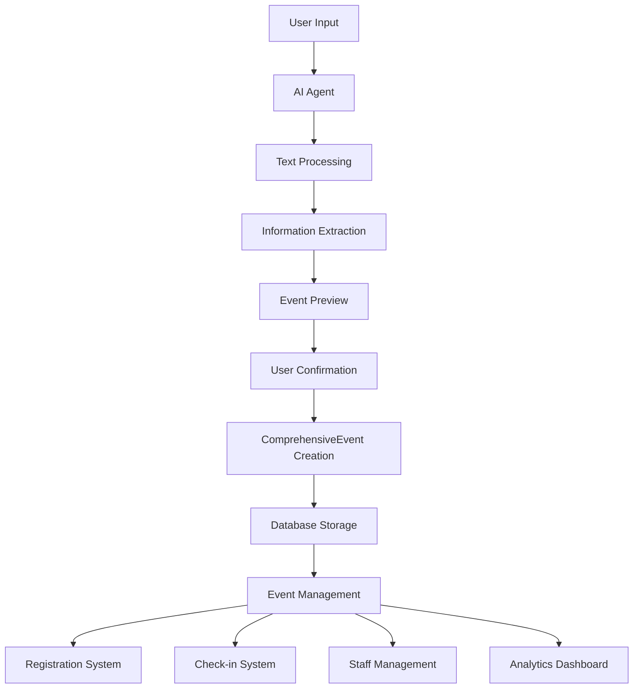

# Event System Architecture Documentation

## 🏗️ System Overview

The LifeLearners event system is designed as a comprehensive, extensible platform for managing educational events, field trips, workshops, and community activities. The architecture supports complex requirements including multi-age groups, supervision tracking, real-time head counts, and sophisticated pricing models.

## 📋 Core Components

### 1. **AI-Powered Event Creation**
- **Natural Language Processing**: Users describe events in plain English
- **Intelligent Extraction**: AI parses details like dates, pricing, age ranges, supervision requirements
- **Real-time Preview**: Split-screen interface shows event building live
- **Fallback Processing**: Works even when AI providers are offline

### 2. **Comprehensive Event Model**
```python
ComprehensiveEvent
├── Basic Info (title, description, type)
├── Scheduling (start/end times, recurrence)
├── Location (physical/virtual venues)
├── Capacity Management (limits, waitlists)
├── Age Groups & Supervision (ratios, requirements)
├── Pricing & Ticketing (multi-tier pricing)
├── Requirements & Policies (health, equipment)
├── Staff & Supervision (assignments, ratios)
├── Media & Marketing (images, videos, tags)
├── Registration Management (forms, approvals)
└── Analytics & Tracking (performance metrics)
```

### 3. **Safety-First Design**
- **Supervision Ratios**: Configurable adult-to-child ratios by age
- **Guardian Requirements**: Automatic enforcement for young children
- **Real-time Head Count**: Live attendance tracking for safety
- **Emergency Procedures**: Built-in evacuation and emergency protocols

## 🔄 Data Flow Architecture



## 🧩 Extensible Architecture

### Adding New Event Types

```python
class EventType(PyEnum):
    # Existing types...
    NEW_TYPE = "new_type"  # Add new event type

# Update AI classification in ai_tools.py
def classify_event_type(description: str) -> EventType:
    # Add classification logic for new type
    if "new type keyword" in description.lower():
        return EventType.NEW_TYPE
```

### Adding Custom Fields

```python
# In ComprehensiveEvent model
custom_fields = Column(JSON, nullable=True)

# Usage example
event.custom_fields = {
    "outdoor_equipment_needed": ["tent", "sleeping_bag"],
    "certification_required": "first_aid",
    "special_dietary_options": ["vegan", "gluten_free"]
}
```

### Extending Supervision Features

```python
class SupervisionLevel(PyEnum):
    LIFEGUARD_REQUIRED = "lifeguard"      # For water activities
    MEDICAL_STAFF = "medical"             # For high-risk activities
    CERTIFIED_INSTRUCTOR = "certified"    # For specialized skills

# Add to supervision_ratio JSON field
supervision_ratio = {
    "water_activities": {"ratio": 4, "certified_lifeguard": True},
    "high_ropes": {"ratio": 6, "certified_instructor": True}
}
```

## 📱 Real-time Features Implementation

### Head Count System

```python
class EventCheckIn(Base):
    # Real-time tracking fields
    location_within_venue = Column(String(100))  # "Main Hall", "Playground"
    device_check_in = Column(String(50))         # QR scanner ID
    parent_notification_sent = Column(Boolean)    # Auto-notify parents
    emergency_contact_status = Column(String(50)) # Contact verification
    
    @property
    def current_location(self):
        """Get participant's current location within venue"""
        return self.location_within_venue
    
    def notify_emergency_contact(self):
        """Send notification to emergency contact"""
        # Implementation for emergency notifications
        pass
```

### Live Dashboard Integration

```python
class EventDashboard:
    """Real-time event monitoring dashboard"""
    
    def get_live_headcount(self, event_id: int) -> Dict:
        """Get current head count by location and age group"""
        return {
            "total_present": 45,
            "by_age_group": {"5-8": 12, "9-12": 20, "13-15": 13},
            "by_location": {"main_hall": 30, "playground": 15},
            "supervision_status": "adequate",
            "alerts": []
        }
    
    def check_supervision_ratios(self, event_id: int) -> List[Dict]:
        """Monitor supervision ratios in real-time"""
        # Implementation for ratio monitoring
        pass
```

## 🔧 AI Agent Extensions

### Adding New Tools

```python
class EventCreationTools:
    async def check_weather_conditions(self, date: str, location: str) -> Dict:
        """
        NEW TOOL: Check weather for outdoor events
        
        Args:
            date: Event date (YYYY-MM-DD)
            location: Event location
            
        Returns:
            Weather forecast and recommendations
        """
        # Weather API integration
        return {
            "forecast": "Sunny, 22°C",
            "recommendations": ["Perfect for outdoor activities"],
            "backup_plan_needed": False
        }
    
    async def suggest_catering_options(self, 
                                     participant_count: int,
                                     dietary_requirements: List[str],
                                     budget_per_person: float) -> Dict:
        """
        NEW TOOL: AI-powered catering suggestions
        """
        # Implementation for catering recommendations
        pass
```

### Enhanced Natural Language Processing

```python
def _extract_event_info_fallback(self, user_message: str) -> Dict:
    """Enhanced extraction with new patterns"""
    
    # Add new extraction patterns
    dietary_patterns = [
        r"(vegetarian|vegan|gluten.?free|dairy.?free)",
        r"allergies?.*(nuts?|eggs?|shellfish)"
    ]
    
    equipment_patterns = [
        r"bring.*(water.?bottle|sunhat|closed.?shoes)",
        r"we.?provide.*(materials|equipment|lunch)"
    ]
    
    # Implementation continues...
```

## 📊 Analytics and Reporting

### Event Performance Metrics

```python
class EventAnalytics:
    """Comprehensive event analytics system"""
    
    def calculate_engagement_score(self, event_id: int) -> float:
        """Calculate event engagement based on multiple factors"""
        factors = {
            "registration_speed": 0.3,    # How quickly event filled up
            "participant_retention": 0.2,  # No-show rate
            "feedback_scores": 0.3,        # Post-event ratings
            "repeat_attendance": 0.2       # Previous participants returning
        }
        # Implementation...
    
    def generate_safety_report(self, event_id: int) -> Dict:
        """Generate comprehensive safety report"""
        return {
            "supervision_compliance": "100%",
            "incidents": [],
            "evacuation_time": "2:45",
            "emergency_contact_response": "95%"
        }
```

## 🚀 Future Development Roadmap

### Phase 1: Enhanced Safety Features
- [ ] **QR Code Check-in System**
  - Mobile app for staff
  - Instant parent notifications
  - Real-time location tracking

- [ ] **Emergency Response Integration**
  - One-click emergency protocols
  - Automated authority notifications
  - Parent communication system

### Phase 2: Advanced Supervision
- [ ] **Staff Qualification Tracking**
  - Certification management
  - Automatic qualification matching
  - Training reminder system

- [ ] **Intelligent Scheduling**
  - AI-powered staff allocation
  - Conflict detection and resolution
  - Volunteer coordination

### Phase 3: Smart Operations
- [ ] **Predictive Analytics**
  - Demand forecasting
  - Optimal pricing suggestions
  - Weather impact modeling

- [ ] **Resource Management**
  - Equipment tracking and maintenance
  - Venue utilization optimization
  - Supply chain integration

### Phase 4: Community Features
- [ ] **Social Integration**
  - Family networking features
  - Skill sharing marketplace
  - Community event recommendations

- [ ] **Gamification**
  - Achievement badges for children
  - Learning progress tracking
  - Family engagement scores

## 📚 Implementation Guidelines

### Adding New Features

1. **Extend, Don't Replace**: Always add to existing models rather than creating new ones
2. **Maintain Compatibility**: Ensure new features don't break existing functionality
3. **Document Everything**: Update this documentation with any changes
4. **Test Thoroughly**: Include safety-critical testing for child protection features
5. **Consider Privacy**: All child data must comply with privacy regulations

### Code Style and Standards

```python
class NewFeature:
    """
    Clear docstring explaining the feature's purpose
    
    Args:
        param: Description of parameter
        
    Returns:
        Description of return value
        
    Safety Considerations:
        - Any child safety implications
        - Data privacy requirements
        - Emergency response procedures
    """
    
    def method_name(self, param: type) -> return_type:
        """Method-level documentation"""
        pass
```

### Database Migrations

```python
# Always create migration scripts for schema changes
"""Add new supervision features

Revision ID: abc123
Revises: def456
Create Date: 2024-01-15

"""
from alembic import op
import sqlalchemy as sa

def upgrade():
    # Add new columns with proper defaults
    op.add_column('comprehensive_events', 
                  sa.Column('new_feature', sa.String(100), nullable=True))

def downgrade():
    # Always provide rollback capability
    op.drop_column('comprehensive_events', 'new_feature')
```

## 🔐 Security and Privacy

### Child Protection
- All child data encrypted at rest
- Access logs for all child record views
- Automatic data retention compliance
- Parent consent tracking

### Staff Access Control
- Role-based permissions
- Audit trails for all actions
- Emergency override procedures
- Multi-factor authentication for sensitive operations

## 📞 Support and Maintenance

### Monitoring
- Real-time system health checks
- Event capacity monitoring
- AI agent performance tracking
- User experience metrics

### Backup and Recovery
- Automated daily backups
- Point-in-time recovery capability
- Disaster recovery procedures
- Data integrity verification

---

**Last Updated**: January 2024  
**Version**: 2.0  
**Maintainer**: Event System Team

For questions or suggestions, please contact the development team or create an issue in the project repository. 