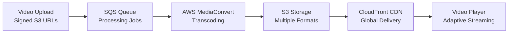

# 🏗️ LifeLearners.org.nz - National Platform Architecture Design

## 🎯 Executive Summary

This document outlines the architectural transformation required to scale LifeLearners.org.nz from a local community platform to a national homeschooling platform serving all 11,000 families across New Zealand. The design addresses multi-tenancy, scalability, new features (video courses, chat), and cost-effectiveness while maintaining excellent performance.

## 📊 Current State Analysis

### **Existing Strengths**
- ✅ **Solid Foundation**: FastAPI + SQLAlchemy + PostgreSQL
- ✅ **Payment Integration**: Full Stripe implementation
- ✅ **Security**: CSRF protection, rate limiting, OAuth
- ✅ **Admin Tools**: Comprehensive dashboard and management
- ✅ **Docker Ready**: Containerized deployment

### **Current Limitations**
- ❌ **Single Tenant**: No regional group isolation
- ❌ **Monolithic**: All features in single application
- ❌ **Limited Scale**: Single server deployment
- ❌ **No Real-time**: No chat or live features
- ❌ **Basic Media**: No video streaming capabilities

## 🎯 Requirements & Scale Projections

### **User Scale (5-Year Projection)**
- **11,000 families** = ~25,000 active users
- **Peak concurrent users**: 2,500-5,000
- **Daily active users**: 8,000-12,000
- **Monthly events**: 2,000-3,000
- **Monthly bookings**: 15,000-25,000

### **Regional Distribution**
- **16 Regional Groups** (aligned with NZ education regions)
- **~700 families per region** (average)
- **Regional Admin Hierarchy**: Super → Regional → Local → Group admins

### **New Feature Requirements**
- 🎥 **Video Courses**: Upload, stream, progress tracking
- 💬 **Group Chat**: Regional and interest-based channels
- 📚 **Resource Sharing**: Files, documents, lesson plans
- 📱 **Mobile Apps**: iOS/Android native apps
- 🔔 **Real-time Notifications**: Push, email, SMS
- 📊 **Advanced Analytics**: Usage, engagement, revenue

## 🏗️ Multi-Tenant Architecture Design

### **Tenant Isolation Strategy**

```sql
-- Enhanced User Model with Tenant Hierarchy
CREATE TABLE organizations (
    id UUID PRIMARY KEY,
    name VARCHAR(255) NOT NULL,
    type ENUM('national', 'regional', 'local', 'group'),
    parent_id UUID REFERENCES organizations(id),
    region_code VARCHAR(10), -- NZ region codes
    settings JSONB,
    subscription_tier VARCHAR(50),
    created_at TIMESTAMP DEFAULT NOW()
);

-- Regional Admin Permissions
CREATE TABLE admin_roles (
    id UUID PRIMARY KEY,
    user_id UUID REFERENCES users(id),
    organization_id UUID REFERENCES organizations(id),
    role ENUM('super_admin', 'regional_admin', 'local_admin', 'group_admin'),
    permissions JSONB,
    granted_by UUID REFERENCES users(id),
    granted_at TIMESTAMP DEFAULT NOW()
);

-- Tenant-Aware Event Model
ALTER TABLE events ADD COLUMN organization_id UUID REFERENCES organizations(id);
ALTER TABLE events ADD COLUMN visibility ENUM('public', 'regional', 'local', 'private');
```

### **Row-Level Security (RLS)**
```sql
-- Ensure users only see events from their region or public events
CREATE POLICY event_visibility ON events
    FOR SELECT
    USING (
        visibility = 'public' OR
        organization_id IN (
            SELECT organization_id FROM user_organizations 
            WHERE user_id = current_user_id()
        )
    );
```

## 🔧 Technology Stack Evolution

### **Current → Recommended Migration**

| Component | Current | Recommended | Reasoning |
|-----------|---------|-------------|-----------|
| **Backend** | FastAPI Monolith | FastAPI + Microservices | Scalability, isolation |
| **Database** | Single PostgreSQL | PostgreSQL RDS Multi-AZ | High availability, backups |
| **Caching** | None | Redis Cluster | Performance, sessions, chat |
| **File Storage** | Local Files | AWS S3 + CloudFront | Scalability, CDN |
| **Video Streaming** | None | AWS MediaConvert + S3 | Professional video delivery |
| **Real-time** | None | WebSocket + Redis | Chat, notifications |
| **Background Jobs** | None | Celery + SQS | Email, video processing |
| **Monitoring** | Basic | CloudWatch + Sentry | Production monitoring |
| **Deployment** | Docker Compose | ECS/EKS + Auto Scaling | Cloud-native scaling |

### **Microservices Architecture**

```yaml
# Services Breakdown
services:
  - name: "auth-service"
    purpose: "Authentication, authorization, user management"
    database: "auth_db (PostgreSQL)"
    
  - name: "tenant-service" 
    purpose: "Organization management, regional hierarchy"
    database: "tenant_db (PostgreSQL)"
    
  - name: "event-service"
    purpose: "Event management, bookings, calendar"
    database: "events_db (PostgreSQL)"
    
  - name: "payment-service"
    purpose: "Stripe integration, billing, subscriptions"
    database: "payments_db (PostgreSQL)"
    
  - name: "media-service"
    purpose: "Video upload, processing, streaming"
    storage: "S3 + CloudFront"
    
  - name: "chat-service"
    purpose: "Real-time messaging, channels"
    database: "Redis + PostgreSQL"
    
  - name: "notification-service"
    purpose: "Email, SMS, push notifications"
    queue: "SQS"
    
  - name: "analytics-service"
    purpose: "Usage tracking, reporting"
    database: "analytics_db (PostgreSQL)"
```

## 🎥 Video Course Architecture

### **Video Processing Pipeline**


### **Video Features Implementation**
- **Adaptive Bitrate Streaming**: HLS/DASH for all devices
- **Progress Tracking**: Resume from last position
- **Access Control**: Regional/group-based permissions
- **Offline Viewing**: Mobile app download capabilities
- **Analytics**: View time, completion rates, engagement

## 💬 Real-Time Chat Architecture

### **Chat Service Design**
```python
# WebSocket Chat Handler
class ChatService:
    def __init__(self):
        self.redis = Redis(cluster=True)
        self.channels = {
            'regional': 'chat:region:{region_id}',
            'group': 'chat:group:{group_id}',
            'event': 'chat:event:{event_id}',
            'direct': 'chat:direct:{user1_id}:{user2_id}'
        }
    
    async def join_channel(self, user_id: str, channel_type: str, channel_id: str):
        # Verify user has permission to join channel
        if await self.verify_channel_access(user_id, channel_type, channel_id):
            channel_key = self.channels[channel_type].format(**{f'{channel_type}_id': channel_id})
            await self.redis.sadd(f'{channel_key}:users', user_id)
            return True
        return False
```

### **Chat Features**
- **Regional Channels**: Automatic based on user location
- **Event Channels**: Created for each event
- **Interest Groups**: Subject-specific discussions
- **Direct Messaging**: Private conversations
- **Moderation Tools**: Regional admin controls
- **Message History**: Searchable, persistent storage

## 💰 Cost Optimization Strategy

### **Infrastructure Cost Projections (Monthly)**

| Component | Small (5K users) | Medium (15K users) | Large (25K users) |
|-----------|-------------------|--------------------|--------------------|
| **EC2/ECS** | $300 | $800 | $1,500 |
| **RDS PostgreSQL** | $150 | $400 | $800 |
| **Redis Cluster** | $100 | $250 | $500 |
| **S3 + CloudFront** | $50 | $200 | $400 |
| **Load Balancer** | $25 | $25 | $50 |
| **SQS/SNS** | $10 | $30 | $60 |
| **CloudWatch** | $20 | $50 | $100 |
| **Total** | **$655** | **$1,755** | **$3,410** |

### **Revenue Model Integration**
- **Booking Fees**: 3-5% per paid booking
- **Premium Features**: Video courses, advanced analytics
- **Regional Subscriptions**: Annual fees for enhanced features
- **Marketplace**: Commission on resource sales

### **Cost Optimization Techniques**
1. **Auto Scaling**: Scale down during off-peak hours
2. **Spot Instances**: Use for background processing
3. **Reserved Instances**: 40% savings on predictable workloads
4. **S3 Intelligent Tiering**: Automatic cost optimization
5. **CloudFront**: Reduce origin server load

## 📱 Mobile App Strategy

### **Progressive Web App (PWA) First**
```javascript
// PWA Service Worker for Offline Support
const CACHE_NAME = 'lifelearners-v1';
const urlsToCache = [
    '/',
    '/events',
    '/chat',
    '/profile',
    '/static/css/main.css',
    '/static/js/main.js'
];

self.addEventListener('fetch', event => {
    event.respondWith(
        caches.match(event.request)
            .then(response => response || fetch(event.request))
    );
});
```

### **Native Apps (Phase 2)**
- **React Native**: Single codebase for iOS/Android
- **Offline-First**: Sync when connection available
- **Push Notifications**: Event reminders, chat messages
- **Native Features**: Camera, GPS, biometric auth

## 🔐 Security & Compliance

### **Enhanced Security Measures**
- **Zero Trust Architecture**: Verify every request
- **API Gateway**: Rate limiting, authentication
- **WAF (Web Application Firewall)**: DDoS protection
- **Encryption**: At rest (KMS) and in transit (TLS 1.3)
- **Audit Logging**: All admin actions tracked

### **New Zealand Compliance**
- **Privacy Act 2020**: Data protection compliance
- **Child Safety**: Additional protections for minors
- **Data Sovereignty**: All data stored in NZ/Australia
- **Accessibility**: WCAG 2.1 AA compliance

## 📊 Monitoring & Analytics

### **Application Monitoring Stack**
```yaml
monitoring:
  metrics:
    - service: "CloudWatch"
      coverage: "Infrastructure, custom metrics"
    - service: "New Relic/DataDog"  
      coverage: "APM, user experience"
  
  logging:
    - service: "CloudWatch Logs"
      retention: "30 days standard, 1 year critical"
    - service: "ELK Stack"
      purpose: "Search, analysis, visualization"
  
  error_tracking:
    - service: "Sentry"
      coverage: "Application errors, performance"
  
  uptime:
    - service: "Pingdom/StatusCake"
      coverage: "External monitoring, alerts"
```

### **Business Analytics**
- **User Engagement**: Daily/monthly active users
- **Regional Performance**: Adoption by region
- **Feature Usage**: Video views, chat activity
- **Revenue Tracking**: Booking fees, subscriptions
- **Operational Metrics**: System performance, costs

## 🚀 Implementation Roadmap

### **Phase 1: Foundation (Months 1-3)**
- [ ] **Multi-tenant Database**: Implement organization hierarchy
- [ ] **API Gateway**: Centralized authentication and routing
- [ ] **Regional Admin UI**: Hierarchical permission system
- [ ] **Basic Video Upload**: S3 integration without processing
- [ ] **Redis Integration**: Caching and sessions

### **Phase 2: Core Features (Months 4-6)**
- [ ] **Video Processing**: MediaConvert integration
- [ ] **Real-time Chat**: WebSocket implementation
- [ ] **Mobile PWA**: Responsive design and offline support
- [ ] **Advanced Analytics**: Usage tracking and reporting
- [ ] **Background Jobs**: Celery + SQS implementation

### **Phase 3: Scale & Polish (Months 7-9)**
- [ ] **Auto Scaling**: ECS/EKS with auto scaling groups
- [ ] **Native Mobile Apps**: React Native development
- [ ] **Advanced Video Features**: Progress tracking, adaptive streaming
- [ ] **Performance Optimization**: Caching, CDN, database tuning
- [ ] **Load Testing**: Simulate 5K+ concurrent users

### **Phase 4: National Launch (Months 10-12)**
- [ ] **Regional Rollout**: Gradual expansion across NZ
- [ ] **Marketing Integration**: Analytics, A/B testing
- [ ] **Support Systems**: Help desk, documentation
- [ ] **Compliance Audit**: Security and privacy review
- [ ] **Disaster Recovery**: Multi-AZ deployment, backups

## 💡 Technical Implementation Details

### **Database Sharding Strategy**
```python
# Tenant-aware database routing
class TenantRouter:
    def db_for_read(self, model, **hints):
        if hasattr(model, 'organization_id'):
            region = self.get_region_for_org(model.organization_id)
            return f'region_{region}_replica'
        return 'default'
    
    def db_for_write(self, model, **hints):
        if hasattr(model, 'organization_id'):
            region = self.get_region_for_org(model.organization_id)
            return f'region_{region}_primary'
        return 'default'
```

### **Caching Strategy**
```python
# Multi-level caching
class CacheService:
    def __init__(self):
        self.redis = Redis(cluster=True)
        self.local_cache = TTLCache(maxsize=1000, ttl=300)
    
    async def get_events(self, organization_id: str, cache_key: str):
        # L1: Local cache (5 minutes)
        if cache_key in self.local_cache:
            return self.local_cache[cache_key]
        
        # L2: Redis cache (1 hour)
        cached = await self.redis.get(f"events:{organization_id}:{cache_key}")
        if cached:
            self.local_cache[cache_key] = cached
            return cached
        
        # L3: Database
        events = await self.fetch_from_db(organization_id)
        await self.redis.setex(f"events:{organization_id}:{cache_key}", 3600, events)
        self.local_cache[cache_key] = events
        return events
```

## 🎯 Success Metrics & KPIs

### **Technical Metrics**
- **Uptime**: 99.9% availability target
- **Response Time**: <200ms API responses, <2s page loads
- **Scalability**: Handle 5K concurrent users without degradation
- **Error Rate**: <0.1% application errors

### **Business Metrics**
- **User Adoption**: 60% of NZ homeschool families within 2 years
- **Engagement**: 70% monthly active users
- **Revenue**: Cover operational costs through booking fees
- **Satisfaction**: >4.5/5 user satisfaction score

## 🔮 Future Enhancements

### **Advanced Features (Year 2+)**
- **AI Recommendations**: Personalized event suggestions
- **Virtual Reality**: VR classroom experiences
- **Blockchain Certificates**: Verifiable achievements
- **API Marketplace**: Third-party integrations
- **International Expansion**: Australia, UK markets

### **Technology Evolution**
- **Edge Computing**: Regional CDN optimization
- **Machine Learning**: Usage analytics, fraud detection
- **GraphQL**: Efficient mobile API queries
- **Kubernetes**: Advanced orchestration and scaling

## 💼 Business Impact

### **Value Proposition**
- **For Families**: Centralized hub for all homeschool needs
- **For Regional Groups**: Autonomous management with shared infrastructure
- **For Administrators**: Comprehensive analytics and oversight
- **For NZ Education**: Better tracking and support of homeschool outcomes

### **Competitive Advantages**
- **First-mover**: No existing national NZ platform
- **Government Relations**: Potential MOE partnerships
- **Community Focus**: Built by homeschoolers for homeschoolers
- **Technical Excellence**: Modern, scalable architecture

## 📋 Risk Assessment & Mitigation

### **Technical Risks**
| Risk | Impact | Probability | Mitigation |
|------|---------|-------------|------------|
| **Scaling Issues** | High | Medium | Load testing, auto-scaling |
| **Data Loss** | Critical | Low | Multi-AZ, automated backups |
| **Security Breach** | High | Low | Security audits, WAF, monitoring |
| **Regional Isolation Failure** | Medium | Low | Comprehensive testing, RLS |

### **Business Risks**
| Risk | Impact | Probability | Mitigation |
|------|---------|-------------|------------|
| **Low Adoption** | Critical | Medium | Gradual rollout, user feedback |
| **Funding Shortfall** | High | Low | Multiple revenue streams |
| **Regulatory Changes** | Medium | Low | Compliance monitoring |
| **Competition** | Medium | Medium | Feature differentiation |

## 🎯 Conclusion

This architecture design provides a robust, scalable foundation for transforming LifeLearners.org.nz into New Zealand's premier homeschooling platform. The multi-tenant design ensures regional autonomy while maintaining cost efficiency, and the microservices architecture enables rapid feature development and scaling.

The projected infrastructure costs ($655-$3,410/month) are easily sustainable through booking fees and premium features, while the technical foundation supports growth to 25,000+ users with excellent performance.

The phased implementation approach minimizes risk while enabling rapid value delivery, positioning the platform for successful national adoption and potential international expansion.

**Next Steps:**
1. **Stakeholder Review**: Present to homeschool community leaders
2. **Technical Validation**: Proof-of-concept development
3. **Funding Strategy**: Secure initial development funding
4. **Team Assembly**: Hire additional developers as needed
5. **Phase 1 Implementation**: Begin foundation development

This architecture represents a transformational opportunity to serve New Zealand's entire homeschooling community with a world-class platform that scales efficiently while maintaining the personal touch that makes homeschooling special. 